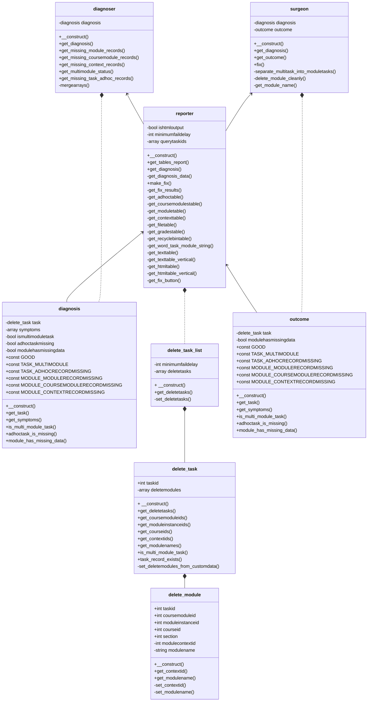

```mermaid
classDiagram
    diagnoser <-- reporter
    reporter <-- diagnosis
    reporter *.. delete_task_list
    diagnoser *.. diagnosis
    surgeon <-- reporter
    reporter <-- outcome
    surgeon *.. outcome
    delete_task *-- delete_module
    delete_task_list *-- delete_task
    class delete_task_list{
        -int minimumfaildelay
        -array deletetasks
        + __construct()
        +get_deletetasks()
        -set_deletetasks()
    }
    class delete_task{
        +int taskid
        -array deletemodules
        + __construct()
        +get_deletetasks()
        +get_coursemoduleids()
        +get_moduleinstanceids()
        +get_courseids()
        +get_contextids()
        +get_modulenames()
        +is_multi_module_task()
        +task_record_exists()
        -set_deletemodules_from_customdata()
    }
    class delete_module{
        +int taskid
        +int coursemoduleid
        +int moduleinstanceid
        +int courseid
        +int section
        -int modulecontextid
        -string modulename
        +__construct()
        +get_contextid()
        +get_modulename()
        -set_contextid()
        -set_modulename()
    }
    class diagnoser{
        -diagnosis diagnosis
        +__construct()
        +get_diagnosis()
        +get_missing_module_records()
        +get_missing_coursemodule_records()
        +get_missing_context_records()
        +get_multimodule_status()
        +get_missing_task_adhoc_records()
        -mergearrays()
    }
    class diagnosis{
        -delete_task task
        -array symptoms
        -bool ismultimoduletask
        -bool adhoctaskmissing
        -bool modulehasmissingdata
        +const GOOD
        +const TASK_MULTIMODULE
        +const TASK_ADHOCRECORDMISSING
        +const MODULE_MODULERECORDMISSING
        +const MODULE_COURSEMODULERECORDMISSING
        +const MODULE_CONTEXTRECORDMISSING
        +__construct()
        +get_task()
        +get_symptoms()
        +is_multi_module_task()
        +adhoctask_is_missing()
        +module_has_missing_data()
    }
    class outcome{
        -delete_task task
        -bool modulehasmissingdata
        +const GOOD
        +const TASK_MULTIMODULE
        +const TASK_ADHOCRECORDMISSING
        +const MODULE_MODULERECORDMISSING
        +const MODULE_COURSEMODULERECORDMISSING
        +const MODULE_CONTEXTRECORDMISSING
        +__construct()
        +get_task()
        +get_symptoms()
        +is_multi_module_task()
        +adhoctask_is_missing()
        +module_has_missing_data()
    }
    class surgeon{
        -diagnosis diagnosis
        -outcome outcome
        +__construct()
        +get_diagnosis()
        +get_outcome()
        +fix()
        -separate_multitask_into_moduletasks()
        -delete_module_cleanly()
        -get_module_name()
    }
    class reporter{
        -bool ishtmloutput
        -int minimumfaildelay
        -array querytaskids
        +__construct()
        +get_tables_report()
        +get_diagnosis()
        -get_diagnosis_data()
        +make_fix()
        -get_fix_results()
        -get_adhoctable()
        -get_coursemodulestable()
        -get_moduletable()
        -get_contexttable()
        -get_filetable()
        -get_gradestable()
        -get_recyclebintable()
        -get_word_task_module_string()
        -get_texttable()
        -get_texttable_vertical()
        -get_htmltable()
        -get_htmltable_vertical()
        -get_fix_button()
    }
```